# 各頁面
## 首頁
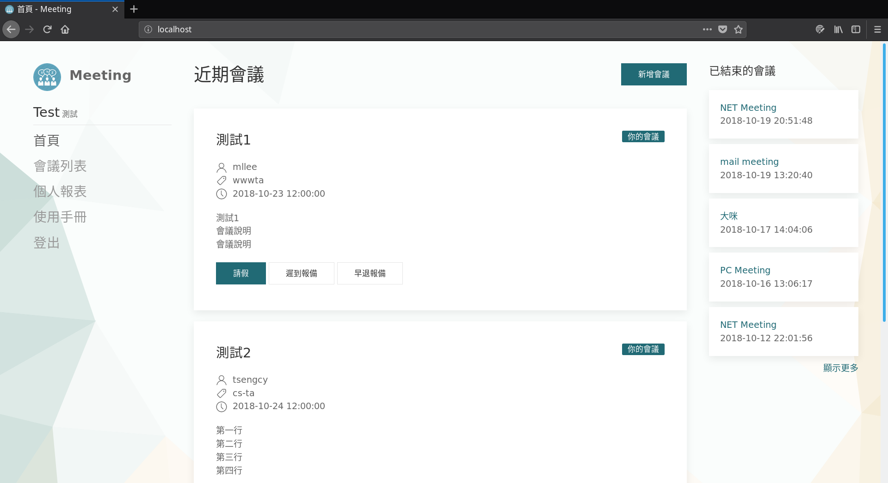
- 近期會議
    - 顯示最近10個新會議或是正在進行中的會議
- 已結束會議
    - 顯示5個最近結束的會議
    - 點選顯示更多可進入會議列表
## 會議詳細資訊
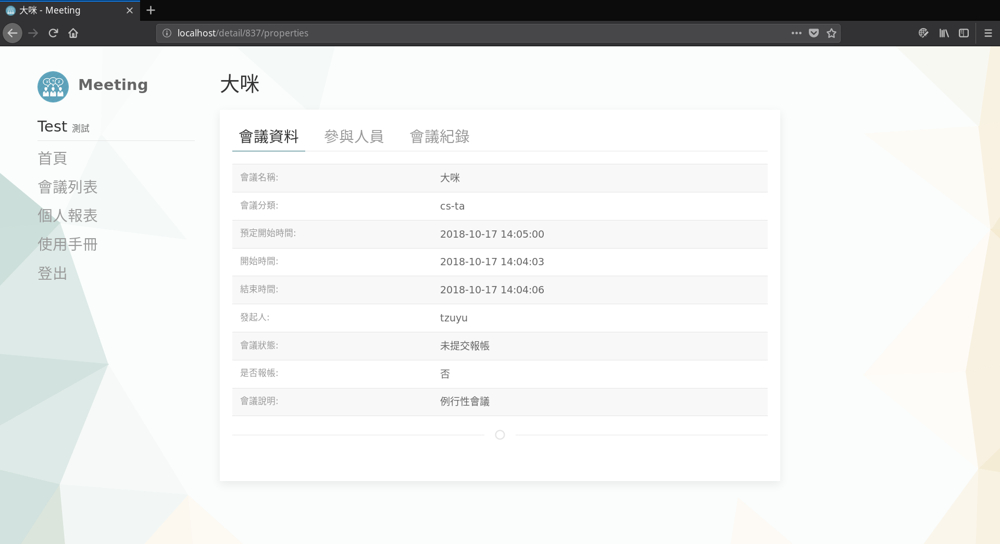
- 顯示會議資料、參與人員、會議記錄的詳細資訊
## 會議列表
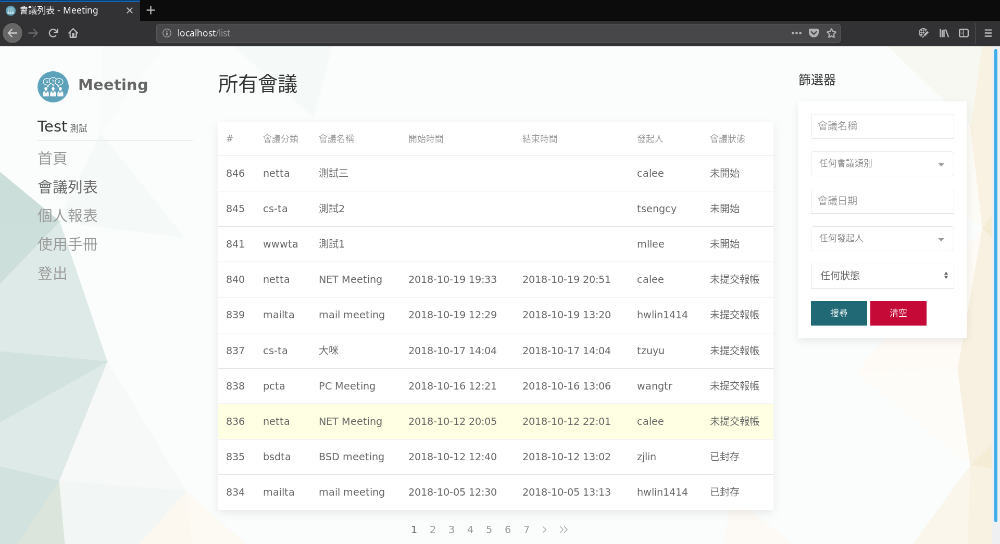
- 顯示所有會議
- 會議共有6種狀態
    1. 未開始
    2. 進行中
    3. 未提交報帳 （會議已結束，待發起人完成紀錄後再提交報帳）
    4. 等待報帳 （等待schedule組敲api報帳） 
    5. 已封存
    6. 已取消
- 篩選器的日期可點選兩個日起來篩選範圍內的會議
## 個人報表
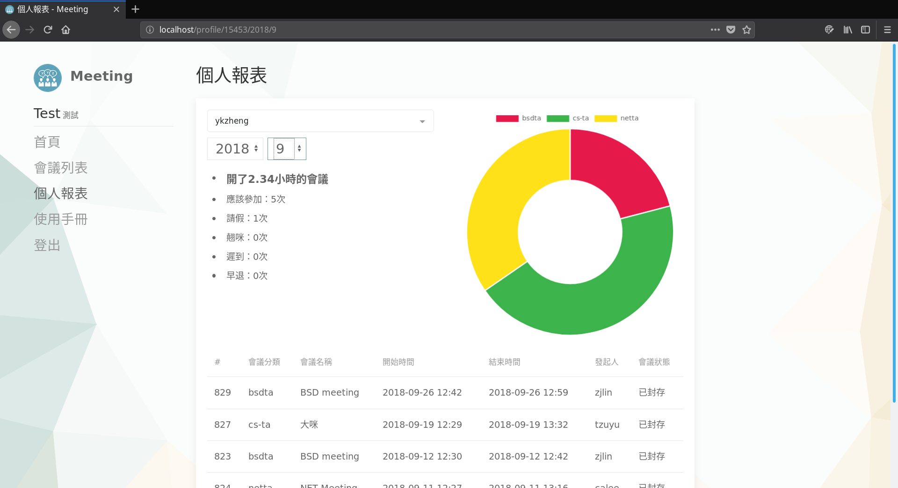
- 可以查詢自己或其他人某個月的會議情況
- 只有發起人已經提交報帳的會議才會納入計算
## 使用手冊
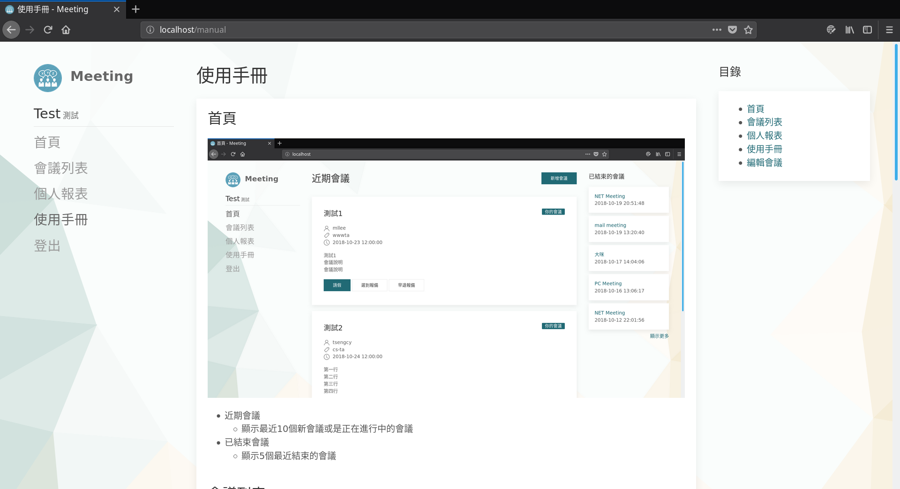
- 顯示本頁面
# 會議發起人操作
## 新增會議
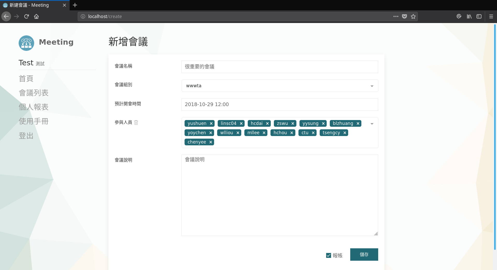
- 所有欄位均須填寫
- 若取消勾選`報帳`欄位，則報帳時只會提報1分鐘給schedule組計薪
- 新增會議後會立即傳送Email通知所有參與人
## 編輯會議

- 只有會議尚未開始時可以變更預計開會時間
- 儲存編輯時可以選擇是否寄送Email通知所有參加者此次變更
## 開始/取消會議

### 開始會議
- 按下開始按鈕後便會紀錄會議開始時間，此時間未來無法更改
- 若**超過表定時間1小時以上**，會議會自動被**取消**，無法再開始
### 取消會議
- 按下後便會將會議狀態改為取消，無法復原
## 點名
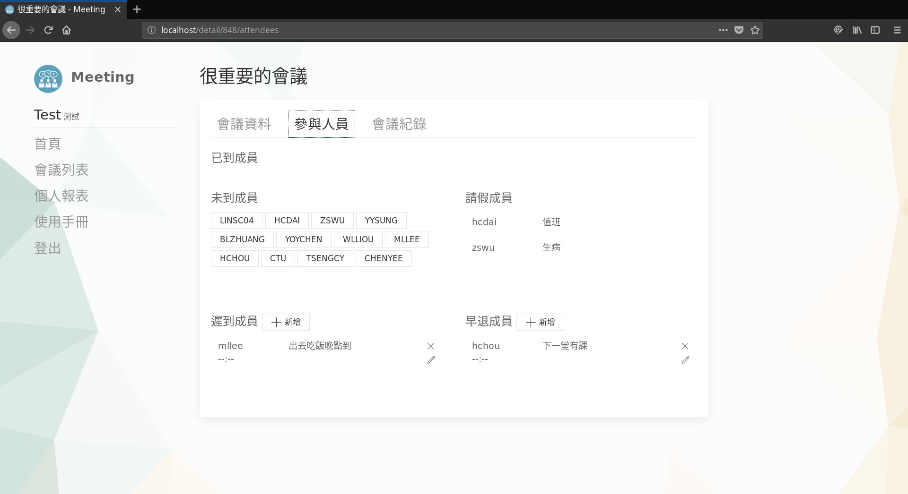
- 此畫面顯示所有參與人員的狀態，包含有事先報備或請假的情況
- 點擊未到成員的姓名會將他移動至已到成員欄位
- 點名資訊會議結束後仍然可以更改
## 遲到/早退
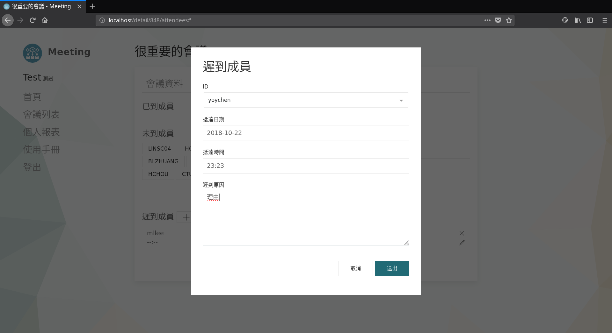
- 若該成員有預先報備，則點擊鉛筆圖示填上正確的離開或到達時間
- 若該成員未預先報備，則點擊新增按鈕新增早退/遲到的紀錄
- 離開/到達日期預設為會議開始的日期，若會議開超過凌晨12點請確認日期是否正確
- 遲到/早退資訊會議結束後仍然可以更改
## 會議記錄
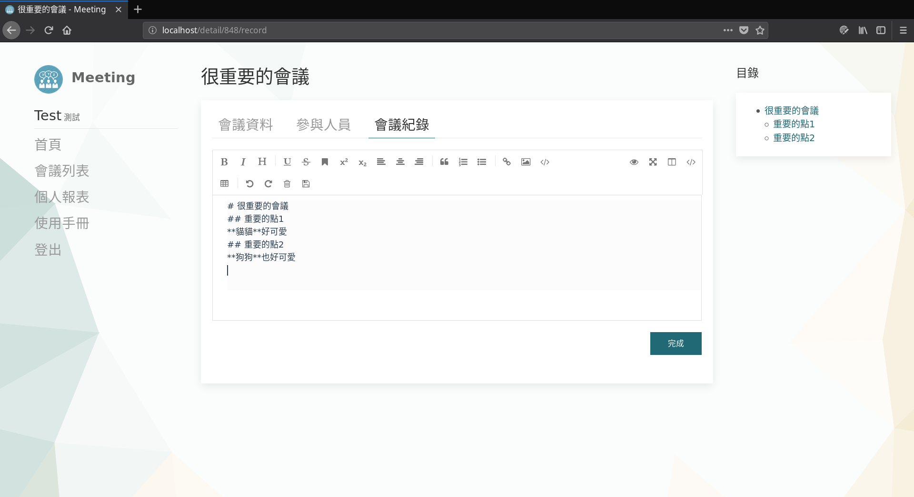
- 提交報帳前都可以編輯會議紀錄
- 會議編輯器採用Markdown格式
- 點擊完成儲存會議記錄並關閉編輯器
### 自動還原
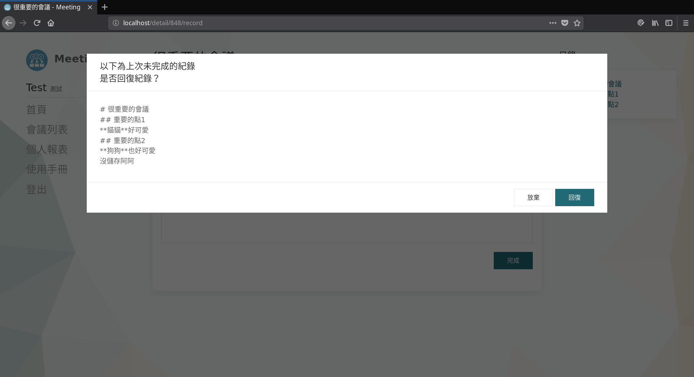
- 編輯會議紀錄同時會在本機瀏覽暫存
- 若編輯時不幸誤關閉瀏覽器或其他悲劇，則使用相同電腦的瀏覽器再度編輯時會詢問時否還原紀錄
## 結束會議
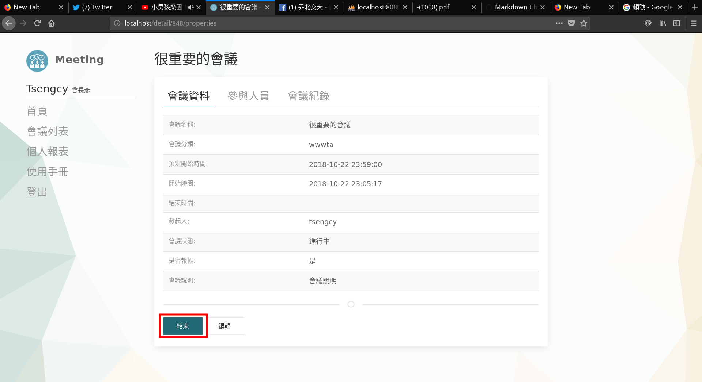
- 會議結束時可以回到首頁或是會議資料頁面點擊結束按鈕
- 點擊後即會紀錄結束時間，事後無法再修改
## 確認會議
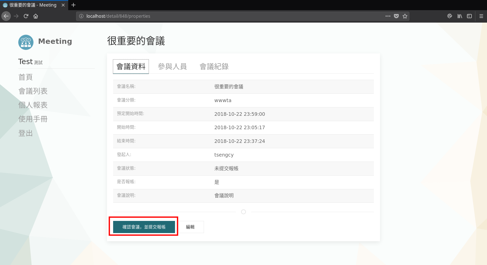
- 確認所有會議紀錄、參加者資訊都正確無誤後方可點擊
- 一旦確認，所有資訊都再無法更改
# 會議參與人操作
- **只有會議舉辦人尚未開始會議時才能進行以下操作**
- 每次請假、取消請假、報備、取消報備均會傳一封email通知會議舉辦人
## 請假
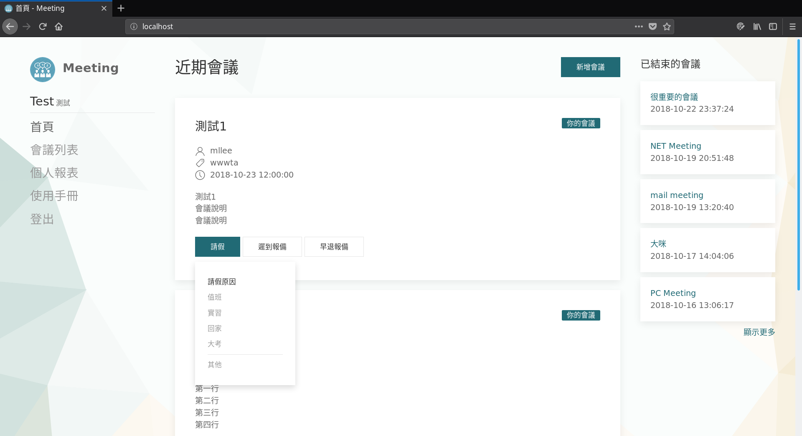
- 點擊後可以選擇預設理由請假或是自行輸入其他理由
## 報備遲到/早退
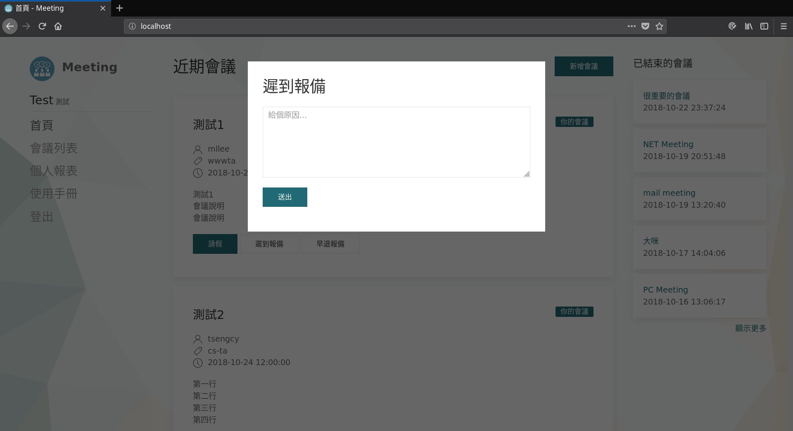
- 點擊後可以輸入遲到/早退理由，可以自行附註約略的到達/離開時間給舉辦人知道
- 若會議時準時到達，主辦人可以取消您遲到/早退的狀態
